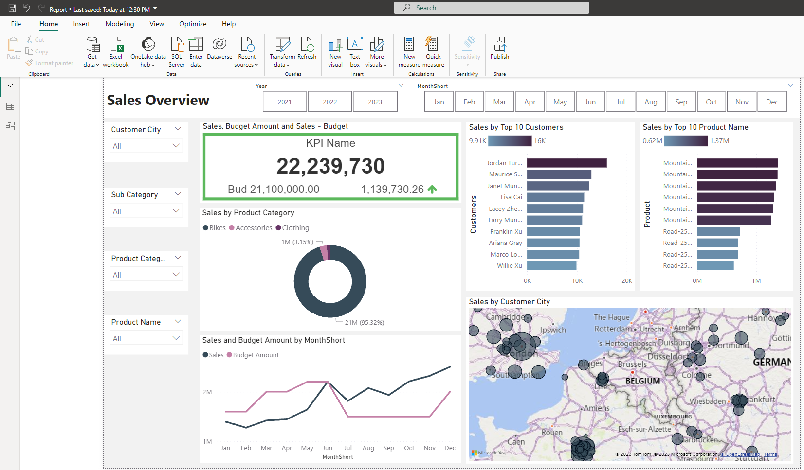

# Sales-Mangement-Analysis


## Business Request & User Stories
The business request for this data analyst project was an executive sales report for sales managers. Based on the request that was made from the business we following user stories were defined to fulfill delivery and ensure that acceptance criteria’s were maintained throughout the project.

| As a (role) | I want (request / demand) | So that I (user value) | Acceptance Criteria |
|:------------|:--------------------------|:-----------------------|:--------------------|
| Sales Manager   | To get a dashboard overview of internet sales   |Can follow better which customers and products sells the best   | A Power BI dashboard which updates data once a day   |
| Sales Representative   | A detailed overview of Internet Sales per Customers   | Can follow up my customers that buys the most and who we can sell more to   | A Power BI dashboard which allows me to filter data for each customer   |
| Sales Representative   | A detailed overview of Internet Sales per Products   | Can follow up my Products that sells the most   | A Power BI dashboard which allows me to filter data for each Product   |
| Sales Manager   | A dashboard overview of internet sales   | Follow sales over time against budget   | A Power Bi dashboard with graphs and KPIs comparing against budget.   |

## Data Cleansing & Transformation (SQL)
To create the necessary data model for doing analysis and fulfilling the business needs defined in the user stories the following tables were extracted using SQL.
One data source (sales budgets) were provided in Excel format and were connected in the data model in a later step of the process.
Below are the SQL statements for cleansing and transforming necessary data.

### *DIM_Calendar:*

<!-- ```SQL
    SELECT 
        [DateKey], 
        [FullDateAlternateKey] AS Date, 
        [EnglishDayNameOfWeek] AS Day, 
        [EnglishMonthName] AS Month, 
        Left([EnglishMonthName], 3) AS MonthShort,   -- Useful for front end date navigation and front end graphs.
        [MonthNumberOfYear] AS MonthNo, 
        [CalendarQuarter] AS Quarter, 
        [CalendarYear] AS Year
    FROM 
        [AdventureWorksDW2019].[dbo].[DimDate]
    WHERE 
        CalendarYear >= 2019
``` -->

### *DIM_Customers:*

    ```SQL
        SELECT 
            c.customerkey AS CustomerKey, 
            c.firstname AS [First Name], 
            c.lastname AS [Last Name], 
            c.firstname + ' ' + lastname AS [Full Name], 
        CASE c.gender WHEN 'M' THEN 'Male' WHEN 'F' THEN 'Female' END AS Gender,
            c.datefirstpurchase AS DateFirstPurchase, 
            g.city AS [Customer City] -- Joined in Customer City from Geography Table
        FROM 
            [AdventureWorksDW2022].[dbo].[DimCustomer] as c
            LEFT JOIN dbo.dimgeography AS g ON g.geographykey = c.geographykey 
        ORDER BY 
            CustomerKey ASC
```

### *Dim_Products:* 

    ```SQL
        SELECT 
            p.[ProductKey], 
            p.[ProductAlternateKey] AS ProductItemCode, 
            p.[EnglishProductName] AS [Product Name], 
            ps.EnglishProductSubcategoryName AS [Sub Category], -- Joined in from Sub Category Table
            pc.EnglishProductCategoryName AS [Product Category], -- Joined in from Category Table
            p.[Color] AS [Product Color], 
            p.[Size] AS [Product Size], 
            p.[ProductLine] AS [Product Line], 
            p.[ModelName] AS [Product Model Name], 
            p.[EnglishDescription] AS [Product Description], 
            ISNULL (p.Status, 'Outdated') AS [Product Status] 
        FROM 
            [AdventureWorksDW2022].[dbo].[DimProduct] as p
            LEFT JOIN dbo.DimProductSubcategory AS ps ON ps.ProductSubcategoryKey = p.ProductSubcategoryKey 
            LEFT JOIN dbo.DimProductCategory AS pc ON ps.ProductCategoryKey = pc.ProductCategoryKey 
        order by 
            p.ProductKey asc
```

### *Fact_InternetSales:*

    ```SQL
        SELECT 
            [ProductKey], 
            [OrderDateKey], 
            [DueDateKey], 
            [ShipDateKey], 
            [CustomerKey], 
            [SalesOrderNumber], 
            [SalesAmount]
        FROM 
            [AdventureWorksDW2019].[dbo].[FactInternetSales]
        WHERE 
            LEFT (OrderDateKey, 4) >= YEAR(GETDATE()) -2 -- Ensures we always only bring two years of date from extraction.
        ORDER BY
            OrderDateKey ASC
```
